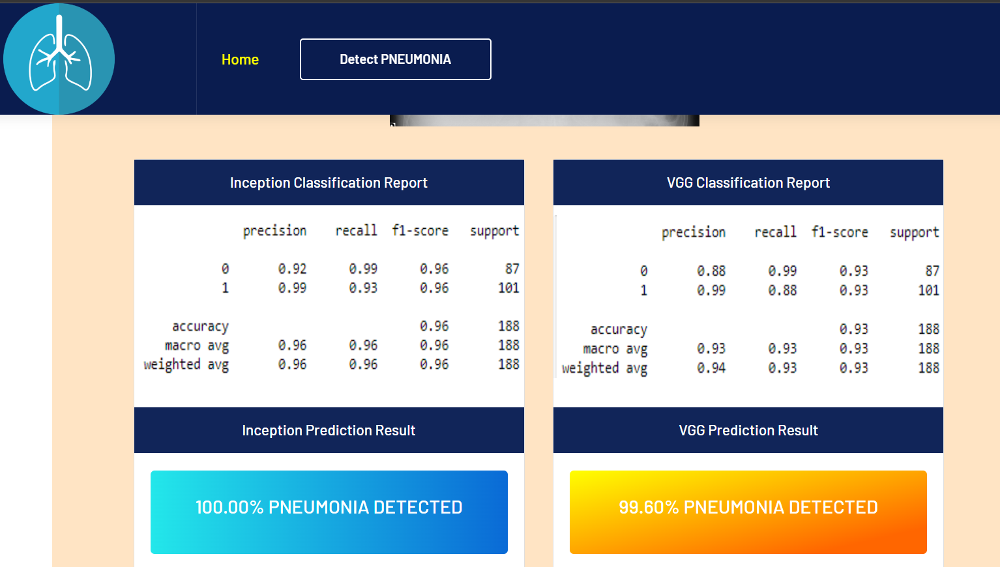

<h1>🩺 Detection and Comparison of Algorithms for Pneumonia Prediction</h1>

  This project focuses on building and evaluating deep learning models to predict pneumonia from chest X-ray images. 
  Leveraging powerful convolutional neural networks (CNNs), it compares the performance of multiple state-of-the-art 
  architectures including <strong>ResNet</strong>, <strong>VGG</strong>, <strong>Inception</strong>, and 
  <strong>Xception</strong>. The goal is to identify the most accurate model for pneumonia detection.

<h2>🌟 Features</h2>
<ul>
  <li><strong>Data Preprocessing</strong>: Involves image resizing, normalization, and augmentation to improve model 
      robustness.</li>
  <li><strong>Model Comparison</strong>: Evaluates the performance of four popular CNN architectures:
    <ul>
      <li><strong>ResNet</strong>: Achieved 74.00% accuracy with pneumonia detection.</li>
      <li><strong>VGG</strong>: Achieved 99.60% accuracy with pneumonia detection.</li>
      <li><strong>Inception</strong>: Achieved 100.00% accuracy with pneumonia detection.</li>
      <li><strong>Xception</strong>: Achieved 100.00% accuracy with pneumonia detection.</li>
    </ul>
  </li>
  <li><strong>Performance Metrics</strong>: Uses accuracy, precision, recall, and F1-score to evaluate models.</li>
  <li><strong>Visualization</strong>: Displays model predictions, training progress, and confusion matrices for 
      better interpretability.</li>
  <li><strong>Transfer Learning</strong>: Implements pre-trained models for improved efficiency and accuracy.</li>
</ul>

<h2>🚀 Technologies Used</h2>
<ul>
  <li><strong>Python</strong>: Primary programming language for model development.</li>
  <li><strong>TensorFlow & Keras</strong>: For building, training, and fine-tuning CNN models.</li>
  <li><strong>NumPy & Pandas</strong>: For data manipulation and analysis.</li>
  <li><strong>Matplotlib & Seaborn</strong>: For visualizing data distributions and model performance.</li>
  <li><strong>OpenCV</strong>: For image processing and augmentation.</li>
</ul>

<h2>📂 Project Structure</h2>
<ul>
  <li><strong>data/</strong>: Contains the chest X-ray images dataset.</li>
  <li><strong>models/</strong>: Pre-trained models and custom-trained CNN architectures.</li>
  <li><strong>notebooks/</strong>: Jupyter notebooks with detailed steps for data preprocessing, model training, and 
      evaluation.</li>
  <li><strong>results/</strong>: Includes performance metrics, plots, and comparison reports.</li>
  <li><strong>README.md</strong>: Documentation with project overview and setup instructions.</li>
</ul>

<h2>🎯 Use Cases</h2>

  This project is ideal for healthcare professionals, data scientists, and AI researchers interested in medical image 
  analysis. It demonstrates the potential of deep learning in early disease detection, supporting accurate and efficient 
  diagnosis of pneumonia from X-ray images.

## Output Screenshots

